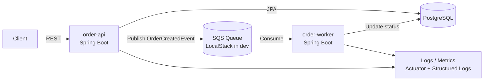
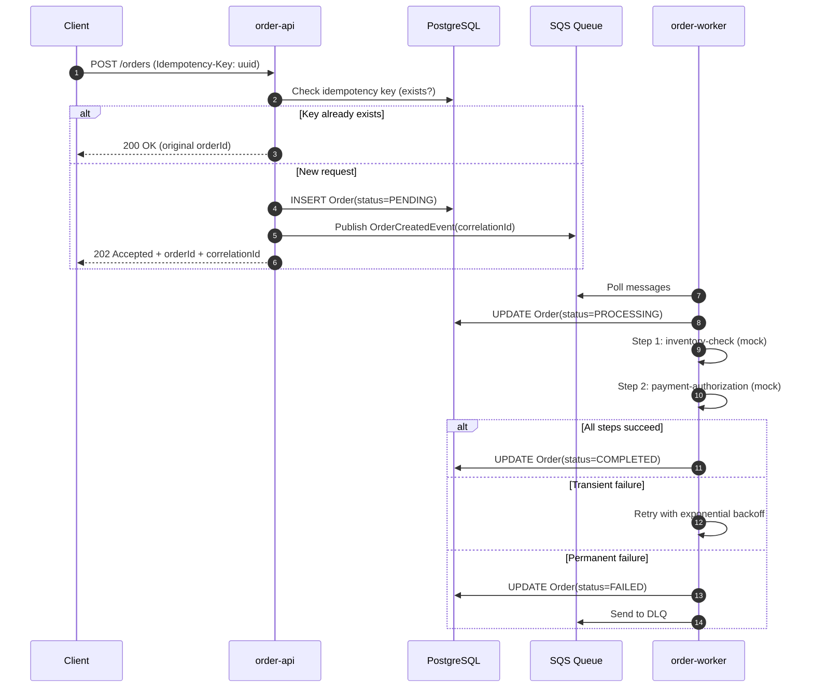
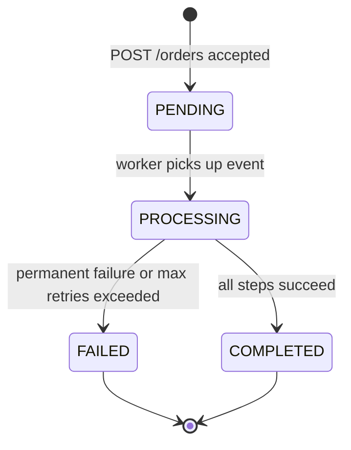

# Capstone Project — Cloud-Native Order Processing Platform

> This document is the single source of truth for the capstone project. Every module in the course contributes a concrete deliverable toward completing this system.

---

## System Description

A production-grade backend platform built with two Spring Boot microservices:

- **`order-api`** — accepts REST requests, validates, persists orders, and publishes domain events to a queue
- **`order-worker`** — consumes events, executes processing steps, and updates order state

The system demonstrates the full lifecycle of a cloud-native backend service: from REST API design through async processing, resilience, observability, containerization, and infrastructure provisioning.

---

## Architecture

### Context Diagram



### Request Flow — POST /orders



### Order State Machine



---

## Functional Requirements

### RF-01 — Create Order

**Endpoint:** `POST /orders`

**Request body:**
```json
{
  "customerId": "cust-123",
  "items": [
    { "sku": "PROD-001", "qty": 2 },
    { "sku": "PROD-002", "qty": 1 }
  ],
  "totalAmount": 149.90
}
```

**Required headers:**
- `Idempotency-Key: <uuid>` — client-generated unique key per request attempt

**Behavior:**
1. Validate payload (customerId required, items non-empty, totalAmount > 0)
2. Check if `Idempotency-Key` already exists → if yes, return original response
3. Persist `Order` with status `PENDING`
4. Publish `OrderCreatedEvent` to SQS with `correlationId`
5. Return `202 Accepted`

**Response:**
```json
{
  "orderId": "a1b2c3d4-...",
  "status": "PENDING",
  "correlationId": "req-uuid-..."
}
```

### RF-02 — Get Order Status

**Endpoint:** `GET /orders/{id}`

**Response:**
```json
{
  "orderId": "a1b2c3d4-...",
  "customerId": "cust-123",
  "status": "COMPLETED",
  "totalAmount": 149.90,
  "createdAt": "2024-01-15T10:30:00Z",
  "updatedAt": "2024-01-15T10:30:05Z"
}
```

### RF-03 — Async Processing

The `order-worker` must:
1. Poll `OrderCreatedEvent` from SQS
2. Update order status to `PROCESSING`
3. Execute processing steps (mocked):
   - `inventory-check`: simulates stock validation
   - `payment-authorization`: simulates payment processing
4. Update final status to `COMPLETED` or `FAILED`

### RF-04 — Idempotency

- `POST /orders` accepts header `Idempotency-Key: <uuid>`
- If the same key is received again (regardless of outcome), return the original response
- Idempotency keys must be stored with TTL or indefinitely (design decision)

### RF-05 — Retry and DLQ

- Transient failures (simulated by random exceptions) trigger retry with exponential backoff
- After max retries, message is sent to Dead Letter Queue
- DLQ messages must be inspectable (logged, optionally persisted)

---

## Non-Functional Requirements

### RNF-01 — Observability

- Structured JSON logs with fields: `timestamp`, `level`, `service`, `correlationId`, `traceId`, `message`
- `correlationId` propagated: HTTP header → SQS message attribute → worker logs
- Actuator endpoints exposed: `/actuator/health`, `/actuator/health/readiness`, `/actuator/health/liveness`, `/actuator/prometheus`

### RNF-02 — Health and Readiness

- Readiness probe verifies:
  - Database connectivity
  - SQS queue accessible (or skipped in dev via flag)
- Liveness probe: basic JVM alive check

### RNF-03 — Horizontal Scalability

- Both services are stateless — any instance handles any request/message
- HPA configured for CPU-based scaling (minimum bar)
- `order-worker` designed for concurrent consumers (no shared in-memory state)

### RNF-04 — Kubernetes Deployment

- Complete manifests for both services:
  - `Deployment`, `Service`, `ConfigMap`, `Secret`, `HPA`
  - PodDisruptionBudget (optional bonus)
- Manifests are OpenShift-compatible (no cluster-admin privileges assumed)

### RNF-05 — Minimal Security

- All write endpoints (`POST /orders`) protected with API key header `X-API-Key`
- API key loaded from Secret/environment variable (never hardcoded)

---

## Acceptance Criteria Checklist

> Use this checklist to verify the capstone is complete. Every item must pass.

### Functional
- [ ] `POST /orders` returns `202 Accepted` with valid `orderId`
- [ ] Duplicate `Idempotency-Key` returns original response, no new order created
- [ ] `GET /orders/{id}` returns current status
- [ ] Event published to SQS after successful order creation
- [ ] Worker consumes event and transitions order to `PROCESSING`
- [ ] Worker completes order and sets status to `COMPLETED`
- [ ] Simulated transient failure triggers retry (visible in logs)
- [ ] Simulated permanent failure sends message to DLQ and sets status to `FAILED`

### Observability
- [ ] All logs are structured JSON
- [ ] `correlationId` appears in every log line for a given request/event
- [ ] `/actuator/health/readiness` returns `UP` when DB and SQS are reachable
- [ ] `/actuator/prometheus` exposes metrics

### Infrastructure
- [ ] `docker-compose up` starts both services + postgres + localstack successfully
- [ ] Both services pass their readiness probe on startup
- [ ] K8s manifests apply cleanly to a local cluster (kind/minikube)
- [ ] HPA is configured and inspectable with `kubectl describe hpa`
- [ ] Terraform `plan` succeeds without errors
- [ ] Terraform `apply` provisions SQS queue and RDS (or LocalStack equivalents)

### Code Quality
- [ ] No hardcoded credentials anywhere in code or manifests
- [ ] Environment-specific config is externalized (env vars / ConfigMap)
- [ ] Retry and circuit breaker are configurable via application properties
- [ ] Multi-stage Docker build produces image < 300MB

---

## Milestones (per module)

| Milestone | After Module | Deliverable |
|---|---|---|
| M1 | 1 — Engineering for Production | `order-api` with layering, exception handling, structured logging, Actuator |
| M2 | 2 — Containers & Runtime | Dockerfile, docker-compose with postgres + localstack, health probes |
| M3 | 3 — Kubernetes/OpenShift | K8s manifests, rolling deploy, HPA on kind/minikube |
| M4 | 4 — AWS Essentials | SQS integration, `order-worker` consuming and processing events |
| M5 | 5 — Terraform IaC | Terraform provisions SQS + RDS, dev/prod env separation |
| M6 | 6 — Resilience Patterns | Retry + circuit breaker + DLQ wired in, Resilience4j config |
| M7 | 7 — Observability | Structured logs, correlationId, Prometheus metrics, readiness wired |
| M8 | 8 — Senior Communication | All acceptance criteria passing, architecture defense documented |

---

## Sample curl Commands

```bash
# Create order (replace API_KEY and BASE_URL as needed)
curl -X POST http://localhost:8080/orders \
  -H "Content-Type: application/json" \
  -H "Idempotency-Key: $(uuidgen)" \
  -H "X-API-Key: dev-secret-key" \
  -d '{
    "customerId": "cust-123",
    "items": [
      { "sku": "PROD-001", "qty": 2 }
    ],
    "totalAmount": 59.90
  }'

# Expected response
# HTTP 202 Accepted
# {
#   "orderId": "a1b2c3d4-e5f6-...",
#   "status": "PENDING",
#   "correlationId": "req-7890-..."
# }

# Get order status
curl http://localhost:8080/orders/a1b2c3d4-e5f6-... \
  -H "X-API-Key: dev-secret-key"

# Check health
curl http://localhost:8080/actuator/health/readiness

# Test idempotency (same Idempotency-Key twice)
IKEY=$(uuidgen)
curl -X POST http://localhost:8080/orders \
  -H "Idempotency-Key: $IKEY" \
  -H "X-API-Key: dev-secret-key" \
  -H "Content-Type: application/json" \
  -d '{ "customerId": "cust-999", "items": [{"sku":"X","qty":1}], "totalAmount": 10.00 }'
# Second call with same IKEY — must return same orderId, no duplicate in DB
curl -X POST http://localhost:8080/orders \
  -H "Idempotency-Key: $IKEY" \
  -H "X-API-Key: dev-secret-key" \
  -H "Content-Type: application/json" \
  -d '{ "customerId": "cust-999", "items": [{"sku":"X","qty":1}], "totalAmount": 10.00 }'
```

---

## Expected Log Format

```json
{
  "timestamp": "2024-01-15T10:30:00.123Z",
  "level": "INFO",
  "service": "order-api",
  "correlationId": "req-a1b2c3d4",
  "traceId": "trace-xyz-789",
  "thread": "http-nio-8080-exec-1",
  "logger": "com.example.order.service.OrderService",
  "message": "Order created successfully",
  "orderId": "a1b2c3d4-e5f6-7890",
  "customerId": "cust-123"
}
```

```json
{
  "timestamp": "2024-01-15T10:30:01.456Z",
  "level": "INFO",
  "service": "order-worker",
  "correlationId": "req-a1b2c3d4",
  "thread": "SQSConsumer-1",
  "logger": "com.example.worker.service.OrderProcessor",
  "message": "Processing order step: inventory-check",
  "orderId": "a1b2c3d4-e5f6-7890",
  "step": "inventory-check"
}
```

*Note: the same `correlationId` (`req-a1b2c3d4`) appears in both `order-api` and `order-worker` logs for the same order — making it trivial to trace a full request across services.*
